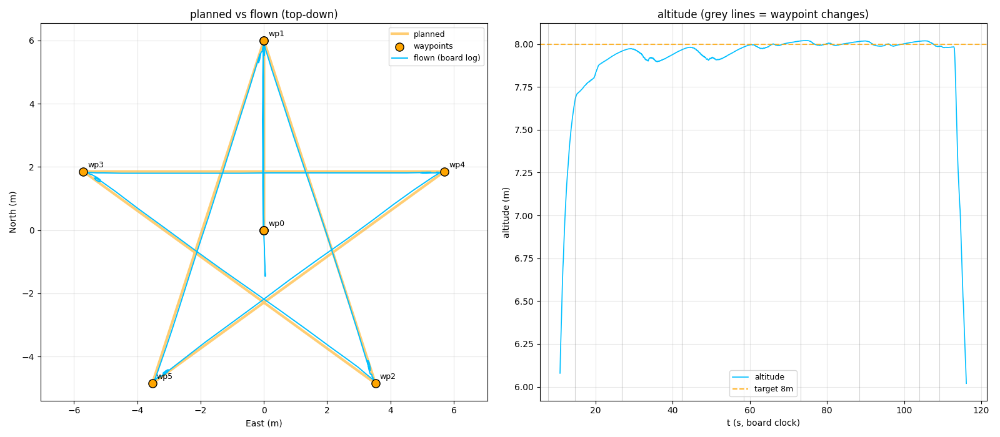

# OpenPilotAI

A software-in-the-loop (SITL) autonomy stack for **NinjaPilot** (an
independent fork of OpenPilot 15.02), pairing the firmware's SimPosix target
with **Gazebo Harmonic** physics and a Python ground station. It flies real
GCS-style waypoint missions end-to-end — upload, arm, climb, fly, land,
auto-disarm — with the firmware's own estimator, path planner, and flight
recorder doing the work, and a full three-log analysis after every flight.

Verified performance (star mission, 6 m radius, five 144° hairpin corners):
**0.04 m mean / 0.10 m max cross-track, stops within 0.10 m of every
vertex, zero overshoot** (run star137).



That plot is run **star137**, the best flight this stack has produced, and
it is worth reading closely because every hard-won fix is visible in it:

- **The flown line (cyan) sits on the planned line (amber) so tightly they
  read as one stroke** — max deviation 0.10 m over a 120 s mission. Earlier
  in this project the same mission bowed its legs by 0.25 m and looped a
  half-metre "cursive-l" at every point.
- **The corners are points, not loops.** The vehicle brakes to a stop within
  0.10 m of each star tip, is released the instant arrival is confirmed
  (~1 s, not the 13 s "toilet-bowl" the old acceptance logic caused), and
  accelerates straight out. Turn-direction errors — the left hook at
  right-hand corners that took ~15 runs to isolate — are gone because
  mission yaw holds AxisLock instead of sweeping mid-flight.
- **The altitude trace (right) holds 8 m within ~0.3 m through every corner
  transient**, with the grey waypoint-transition lines showing evenly-paced
  legs — no stalls, no re-approaches.
- It was flown by the **firmware's own estimator and path planner** on
  injected sensors — not by the ground station steering from truth data.

The complete evidence for this run — bridge ground-truth log, the FC's own
on-board flight recorder, the (deliberately empty) Gazebo server log, and
the three-log analysis that cross-checks them — ships in
[`examples/`](examples/), so the claim above is reproducible, not a
screenshot.

```
OpenPilotAI/
├── README.md                  <- you are here
├── flight/                    the FULL firmware source: SimPosix target,
│                              posix PIOS layer, FreeRTOS V11.3.0 kernel,
│                              all modules incl. the resurrected Autotune
├── make/ package/ Makefile    the firmware build system
├── ground/
│   ├── gazebo_bridge/         the bridge, harness, worlds, models, tools
│   ├── pyuavtalk/             minimal Python UAVTalk/UAVObjects client
│   └── uavobjgenerator/       UAVObject code generator (built by make)
├── shared/                    UAVObject XMLs + version info templates
├── examples/                  a complete real flight: photo + all three logs
└── docs/
    ├── PROJECT-NOTES.md       hard-won findings, mechanisms, dead ends
    └── RECIPES.md             operational recipes and idioms
```

This repo is **fully self-contained**: the ground stack runs from it and
the firmware builds from it (verified: a clean `make simposix` from a fresh
copy of this tree produces `fw_simposix.elf`).

---

## Getting it running

### Prerequisites (macOS / Homebrew)

```bash
xcode-select --install          # host compiler + make (if not present)
brew install gz-harmonic python@3.13 qt
```

- `gz-harmonic` installs Gazebo and its Python bindings (`gz.transport13`,
  `gz.msgs10`) into Homebrew's site-packages — which is why the venv below
  must be created **with `--system-site-packages`**.
- `qt` provides `qmake`, which the firmware build uses once to build the
  UAVObject code generator (verified working with Qt 6). The optional
  wind/GPS gz-gui panels additionally want `qt@5` (gz-gui is Qt5-based).
- No ARM cross-toolchain is needed for SITL: the simposix target overrides
  the ARM prefix and compiles with the host compiler. (An
  `arm-none-eabi-` toolchain is only needed to build the real-hardware
  targets like `fw_revolution`.)

### 1. Python environment

```bash
cd OpenPilotAI/ground/gazebo_bridge
python3.13 -m venv --system-site-packages venv
./venv/bin/pip install matplotlib numpy protobuf
./venv/bin/python3 -c "import gz.transport13; print('gz bindings OK')"
```

### 2. Firmware (builds from THIS repo)

Build in a separate directory (keeps artifacts out of the source tree; the
version stamp wants the `.git` present, so rsync *with* it):

```bash
rsync -a OpenPilotAI/ ~/ninjapilot-build/
cd ~/ninjapilot-build && make -j8 simposix
mkdir -p ~/ninjapilot-build/fcwd
```

That produces `~/ninjapilot-build/build/fw_simposix/fw_simposix.elf` — the
actual flight firmware, run as a host process. `fcwd/` is its working
directory; the on-"flash" flight-recorder slots appear there as files.

### 3. Gazebo (server + GUI — macOS needs them in separate processes)

```bash
cd OpenPilotAI/ground/gazebo_bridge
export GZ_SIM_RESOURCE_PATH="$PWD/models"
export GZ_GUI_PLUGIN_PATH="$PWD/gui_plugins/WindControl/build"   # after building them
gz sim -s -r worlds/quadcopter_ninjapilot.sdf &     # server
gz sim -g &                                          # GUI
```

Optional GUI panels (wind + GPS-noise sliders, top-right of the Gazebo
window) build with CMake against Qt5/gz-gui:
`cd gui_plugins/WindControl && mkdir build && cd build && cmake .. && make`.

Keep Gazebo running between flights — the harness resets the scene instead
of relaunching (relaunch only if the world SDF changed).

---

## Run examples

### Fly the star (the one-command harness)

```bash
cd OpenPilotAI/ground/gazebo_bridge
TMPDIR=/tmp ./run_star.sh star01
```

`run_star.sh` is the only supported way to fly: it kills stale processes and
*waits* for them to exit, purges the previous flight's recorder slots and
verifies the directory is empty, resets the Gazebo scene, launches firmware
and bridge, flies the mission, then runs the full analysis — and refuses to
run if any step fails. After the flight it deletes the decoded slots and
keeps the 12 most recent decoded logs.

Typical tail of a run:

```
[test] mission_test: PASS - mission complete in 120s, landed at N=-0.75 E=0.02, disarmed
star01   xtrack mean  0.04  p95  0.10  max  0.10 m | alt err mean -0.05 p2p 0.35 m
  mean closest approach 0.10 m   mean overshoot 0.00 m  (n=9)
  planned path matches tools/star_geom.py (9 legs)
  filter vs GPS: mean 0.015 m -> estimator OK
```

plus a PNG (`$TMPDIR/star01.png`): top-down planned-vs-flown and the
altitude profile with waypoint transitions marked.

### Other test modes (run the bridge directly)

```bash
# 60s GPS PositionHold check (~2 min end to end)
NINJAPILOT_TEST_MODE=poshold ./venv/bin/python3 gazebo_bridge.py

# ground-truth-only hover foundation test (bypasses the estimator)
NINJAPILOT_TEST_MODE=manual_hover ./venv/bin/python3 gazebo_bridge.py

# relay autotune: measures the airframe's ultimate gain/period per axis
NINJAPILOT_TEST_MODE=autotune ./venv/bin/python3 gazebo_bridge.py

# pull the on-board flight recorder without flying
NINJAPILOT_TEST_MODE=pull_logs ./venv/bin/python3 gazebo_bridge.py
```

(The firmware must be running from `~/ninjapilot-build/fcwd` with
`NINJAPILOT_EXTERNAL_PHYSICS=1` — `run_star.sh` shows the exact sequence.)

### Environment variables

| variable | default | effect |
|---|---|---|
| `NINJAPILOT_TEST_MODE` | scripted | `mission` / `poshold` / `manual_hover` / `autotune` / `pull_logs` |
| `NINJAPILOT_MISSION` | — | `star` selects the star mission |
| `NINJAPILOT_EXTERNAL_PHYSICS` | — | `1` on the firmware: bridge traffic is the only sensor source |
| `NINJAPILOT_YAW_MODE` | `manual` | `pathdirection` = nose follows the path (~3× tracking cost; see Features) |
| `NINJAPILOT_STAR_ARCS` | off | `1` = experimental CircleRight fillet corners |
| `NINJAPILOT_DEEP_LOG` | off | `1` = also log RateDesired/Gyro/Accel (inner-loop debugging, +24% log) |
| `NINJAPILOT_GUI_FOLLOW` | on | `0` = leave the Gazebo camera free (follow eats manual zoom) |
| `NINJAPILOT_PULL_LOGS` | off | `1` = pull recorder over telemetry too (hardware path; slots-on-disk is the default) |
| `NINJAPILOT_BRIDGE_LOG` / `NINJAPILOT_RUN_LABEL` | — | log path / label used by the analysis |
| `NINJAPILOT_VERBOSE` | off | `1` = high-rate debug prints |

---

## What this stack adds (feature documentation)

### Autonomous missions over the real GCS interface
The bridge uploads multi-instance `Waypoint`/`PathAction` objects with the
`PathPlan` CRC-8 the firmware validates, then engages PathPlanner exactly as
a GCS would. Missions terminate in a `Land` action (plans wrap around
otherwise). The star mission: vertical climb over the pad, five hairpin
star points at 8 m, return, land, auto-disarm.

### Waypoint arrival that actually visits the point
Stock behaviour retired a waypoint the instant the vehicle clipped the
acceptance sphere — at a corner it turned away a full radius short and
never visited the point. Added:
- **Confirmed arrival**: tight sphere + speed-and-dwell test
  (`ConditionParameters[2]/[3]` of `DistanceToTarget`), per-waypoint, so
  corners and fly-throughs coexist in one plan.
- **Half-plane crossing**: a waypoint is also reached the moment the vehicle
  crosses the plane through it perpendicular to the inbound leg (within a
  corridor), killing the "commanded straight back to the point it just
  passed" reversal.
- **Leg cruise speed as a mission property** (`ModeParameters[1]`): legs are
  no longer speed-capped by their own endpoint velocities — previously a
  star whose corners were slow flew its *entire* mission at corner speed
  (measured 0.53 m/s while the config said 1.5).

### Corner handling (the "cursive-l" saga, settled)
Corners are **full stops with instant release**. A large controlled dataset
(docs/PROJECT-NOTES.md) shows carry-through corners flip a coin on turn
direction, and that *yawing while translating corrupts position* ~0.3–0.5 m
per corner via attitude-lag frame rotation — so mission yaw defaults to
AxisLock. `NINJAPILOT_YAW_MODE=pathdirection` re-enables nose-following
(with a partial predicted-yaw compensation in the firmware) at a measured
~3× tracking cost. Experimental `CircleRight` fillet corners exist behind
`NINJAPILOT_STAR_ARCS=1`; first flight failed for documented geometric
reasons.

### On-board flight recorder, enriched
The firmware's own DebugLog is enabled around every flight and decoded from
the slot files afterwards. Beyond position/velocity/attitude, missions log:
`VelocityDesired` (what the path layer *asked*, vs what the vehicle did —
the signal that cracked the corner-orbit mystery), `PathDesired` on change
(the legs the follower was actually given — makes the analysis
self-describing), `ActuatorDesired` (mixer saturation as a measurement),
`SystemStats`, `ManualControlCommand`, `MagState`. The decoder drops uint32
microsecond-wrap timestamp outliers and warns on merged flights.

### Analysis suite (`ground/gazebo_bridge/tools/`)
Every flight is judged on **three logs** — the FC's own recorder, the
bridge's ground truth, and the Gazebo server log — because each alone has
produced confident wrong conclusions (documented cases in the docs).

| tool | question it answers |
|---|---|
| `analyze_run.sh` | runs everything below, plus estimator-health and recorder-coverage checks |
| `score.py` | were the legs straight? (cross-track vs planned) |
| `wp_arrival.py` | did we touch the corners, and did we stop there? |
| `corner_probe.py` | is a corner oscillation commanded, or flown? (needs VelocityDesired) |
| `corner_handedness.py` | which way did the track turn at each vertex vs which way it should |
| `plan_check.py` | is the analysis grading against the mission actually flown? |
| `star_plot.py` | the top-down planned-vs-flown picture + altitude profile |
| `porpoise.py` | oscillation frequency/amplitude per axis |
| `star_geom.py` | single source of truth for the mission geometry (all tools import it) |

### FPV camera array (down / up / 45deg forward)
Three cameras on `X3/base_link`, added as sensors on the existing link so
mass, inertia and therefore all flight tuning are unchanged:

| camera | aim | FOV / rate | purpose |
|---|---|---|---|
| `cam_down` | straight down | 90° @ 40 Hz | vision positioning (VPS) — ground texture flows with translation |
| `cam_up` | straight up | 110° @ 30 Hz | objects crossing overhead, against near-uniform sky |
| `cam_fpv45` | forward, tilted 45° up from the body | 100° @ 30 Hz | FPV convention: level at the horizon when the quad pitches 45° nose-down for forward flight |

Topics are `\/X3\/<name>\/image` plus a per-camera `\/X3\/<name>\/camera_info`
(read intrinsics from there rather than hardcoding a focal length). The
nesting is deliberate: gz-sim derives `camera_info` by replacing the last
topic component, so flat names collapse all three onto one shared topic.

Views are stacked bottom-right in the Gazebo window (Down → FPV 45deg →
Up). The world also declares a world-level `<scene><sky>` — the `<scene>`
inside the GUI plugin block styles only the interactive 3D view and is not
read by sensor rendering, which is why camera frames were flat grey while
the GUI looked right.

`run_gazebo_bridge.sh` passes `--headless-rendering` to the **server**
(not the GUI) so camera sensors don't open a stray visible render window
on macOS.

### Gazebo environment
- **Farm world**: Clearpath Robotics' `cpr_agriculture` scene ported from
  Gazebo Classic (single baked mesh; the model offset places the flight
  area on an open pad *inside* the farm). Physics untouched by the port.
- **Wind + GPS-noise panels**: native gz-gui plugins (sliders in the Gazebo
  window) driving the WindEffects plugin and the bridge's GPS noise
  injection.
- **Mission trails**: translucent planned (amber) / flown (cyan) tubes
  drawn via the /marker service, sized to the craft, throttled so they can
  never starve the sensor feed (a real crash cause, documented).

### Relay autotune (resurrected)
`flight/modules/Autotune` + relay_tuning were removed upstream in 2014;
restored and modernised, plus a yaw relay state the original never had.
Its measurements (roll 113 ms / pitch 155 ms / yaw 560 ms ultimate periods)
anchor several tuning decisions; its ZN gain recipe is deliberately not
applied wholesale.

### Firmware-side changes (all included under `flight/`; key files below)
- `paths.c`: trapezoidal leg speed profile with separate accel/decel, linear
  arrival taper (with a floor so full-stop corners still close), leg cruise
  from `ModeParameters[1]`, past-endpoint fallback so a missed sphere can't
  sail away, and a floor that lets a leg start from a standstill on its own
  start point.
- `pathplanner.c`: confirmed-arrival condition, half-plane crossing,
  next-leg bearing published in `ModeParameters[2]/[3]`.
- `vtolflycontroller.cpp`: distance-blended corner pre-turn (yaw),
  predicted-yaw NED→body conversion (attitude-lag compensation), the
  `ModeParameters` slot-0 union guard (a leg cruise speed of 1.5 used to
  cast to the RTB-LAND enum and land the aircraft mid-mission), and
  documented dead-ends left as comments so they are not retried.
- `filteraltitude.c`: 3-state Kalman vertical channel (covariance-derived
  baro gain, GPS vertical-velocity update that stock code discarded).
- FreeRTOS V11.3.0 upgrade, telemetry transport fixes, and the rest of the
  session history — see `docs/PROJECT-NOTES.md`.

---

## Known open issues

- **Intermittent flyaway at wp3** (~2 in ~15 runs): vehicle departs with the
  FC's own record showing a stable hover — internally consistent,
  externally wrong. Recorder-coverage check is armed; undiagnosed.
- **Nose-following costs ~3× tracking** even with lag compensation; the
  residual mechanism is unidentified (candidates listed in PROJECT-NOTES).
- The sim GPS is idealized-ublox-grade injected post-parser; a real-UBX
  byte-stream path into the firmware's GPS port is designed but
  deliberately not started.
